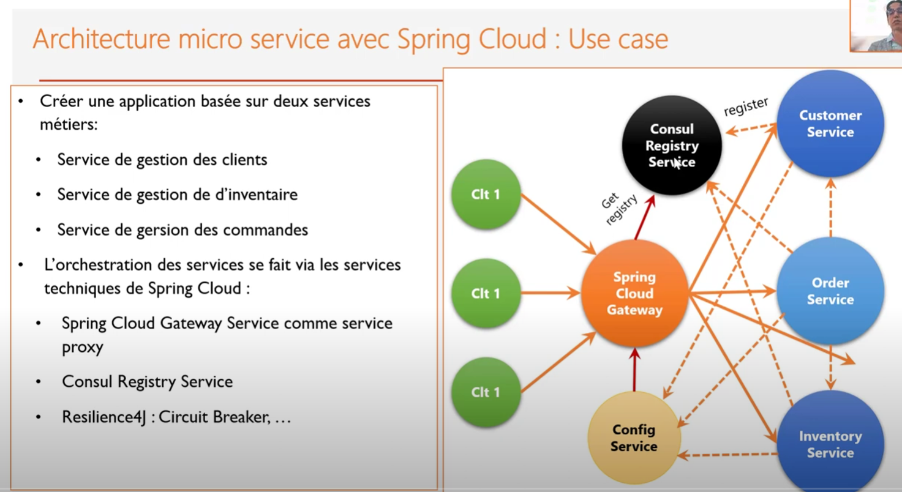

# <center> all-what-you-need-micro-services

Config Service : Config Server  (Spring cloude) || Consul Discovry (Hashicorp) || Actuator
Giteway  : Spring_cloud_giteway ||Consul Discovery ||actuator
Services : Cosnul Dicovery || Config client (spring cloud) || actuator || spring web , jpa , rest jpa , lombok , devtools 
Cosnul_vault : Consuil configuration || vault config || actuator || and other like jpa (not nedeed) sprin web ect..


Microservices , Securite des system distribuee (keyclaok Oauth2 ect ) ,
System Distribuee Asynchrone (event Driven Archetecture (basee sur des broker (kafka..) , comment fair le stream processing) ) , et aussi avec des patter comme CQRS and even sourcing 

 
To effectively explain the concepts discussed in the video transcript, I'll break down the transcript into sections based on the key concepts mentioned. Each section will be detailed with explanations, examples, and the underlying principles. Here's how the Markdown format can be used to organize the information:
<details>  
<summary>Explication</summary>
https://www.youtube.com/watch?v=L36O1edFPJE&list=PLKw5hWNdBUGRAIS-D1nbcFxcYufAnIJ5d&index=7

### **1. Introduction to Key Concepts**

This section introduces the key areas covered in the video: security in distributed systems, JWT, event-driven architectures, and tools like Kafka and Consul.

---

### **2. Security in Distributed Systems**

**Definition:**  
Security in distributed systems refers to the measures and protocols used to protect data, communication, and operations across multiple interconnected systems.

**Context:**  
With the rise of microservices and distributed architectures, securing communication between services, as well as ensuring the integrity and confidentiality of data, has become crucial.

**Key Concepts:**
- **JWT (JSON Web Tokens):**  
  JWT is a compact, URL-safe means of representing claims to be transferred between two parties. It is often used in authentication and authorization processes in distributed systems.

  **Example:**
  ```json
  {
    "alg": "HS256",
    "typ": "JWT"
  }
  .
  {
    "sub": "1234567890",
    "name": "John Doe",
    "admin": true
  }
  .
  <signature>
  ```
    - The header contains the type of token (JWT) and the signing algorithm.
    - The payload contains the claims, such as user information.
    - The signature ensures that the token hasn't been altered.

**Underlying Principles:**
- **Confidentiality:** Ensuring that data is only accessible to authorized parties.
- **Integrity:** Ensuring that data remains unaltered during transmission.
- **Authentication:** Verifying the identity of a user or service.
- **Authorization:** Determining if a user or service has the right to access a resource.

**Why It’s Important:**  
Security is essential in preventing unauthorized access, data breaches, and ensuring that distributed systems operate reliably.

---

### **3. Event-Driven Architectures**

**Definition:**  
Event-driven architectures (EDA) are systems that respond to events or changes in state. They are highly scalable and can handle asynchronous communication between distributed services.

**Context:**  
In modern distributed systems, services often need to communicate with each other asynchronously. EDA allows for decoupling of services, making systems more flexible and resilient.

**Key Concepts:**
- **Message Brokers (e.g., Kafka):**  
  Kafka is a distributed streaming platform that can handle real-time data feeds. It acts as an intermediary that allows services to publish and subscribe to event streams.

  **Example:**
  ```plaintext
  Producer -> Kafka Topic -> Consumer
  ```
    - A producer publishes events to a Kafka topic.
    - A consumer subscribes to the topic and processes the events.

- **Event-Driven vs. Request-Response:**  
  Unlike traditional request-response architectures, where one service requests data from another, in an event-driven architecture, services emit events whenever something happens. Other services can react to these events.

**Underlying Principles:**
- **Decoupling:** Services are independent and communicate through events, reducing dependencies.
- **Scalability:** Systems can easily scale as new services can consume events without affecting the existing architecture.
- **Resilience:** If one service fails, the event-driven system can continue to operate as services are loosely coupled.

**Why It’s Important:**  
EDA is crucial for building scalable, resilient systems that can handle real-time data processing and complex workflows.

---

### **4. Message-Oriented Middleware (MOM) with Kafka**

**Definition:**  
Message-Oriented Middleware (MOM) is software or hardware infrastructure that supports sending and receiving messages between distributed systems.

**Context:**  
Kafka is a popular MOM that supports building real-time streaming data pipelines and event-driven applications.

**Key Concepts:**
- **Kafka as a Distributed Log:**  
  Kafka stores streams of records (messages) in a fault-tolerant way, allowing for high-throughput and low-latency message processing.

  **Example:**
  ```plaintext
  Kafka Cluster -> Topic -> Partitions -> Consumers
  ```
    - Topics are split into partitions to handle large-scale data.
    - Consumers read messages from partitions, enabling parallel processing.

- **Use Cases in Big Data:**  
  Kafka is often used in big data environments to process and analyze large volumes of data in real-time.

**Underlying Principles:**
- **Fault Tolerance:** Kafka can replicate data across multiple nodes, ensuring no data loss.
- **High Throughput:** Kafka can handle large amounts of data with low latency, making it ideal for big data applications.
- **Scalability:** Kafka scales horizontally by adding more brokers and partitions.

**Why It’s Important:**  
Using Kafka enables distributed systems to efficiently handle large-scale data processing and real-time analytics.

---

### **5. Microservices and Service Discovery with Consul**

**Definition:**  
Consul is a tool for service discovery, configuration, and segmentation in microservices architectures.

**Context:**  
In microservices, services need to find and communicate with each other. Consul provides a way to register services and discover them dynamically.

**Key Concepts:**
- **Service Discovery:**  
  Consul allows services to register themselves, and other services can discover them via DNS or HTTP.

  **Example:**
  ```plaintext
  Service A -> Consul -> Service B
  ```
    - Service A queries Consul to find the address of Service B.

- **Health Checks:**  
  Consul can perform health checks on services, ensuring that only healthy services are available for discovery.

**Underlying Principles:**
- **Dynamic Configuration:** Consul can update configuration settings across services in real-time.
- **Decentralization:** Services can discover each other without hard-coded IP addresses or URLs.
- **Resilience:** If a service becomes unhealthy, Consul can automatically remove it from the pool of available services.

**Why It’s Important:**  
Service discovery is essential in microservices to maintain flexibility and resilience, especially in dynamic environments where services are frequently added or removed.

---

### **6. Conclusion**

In this video, the key concepts of security, event-driven architectures, message brokers, and service discovery were explored. Each concept plays a critical role in building robust, scalable, and secure distributed systems. Understanding these principles and tools like JWT, Kafka, and Consul is crucial for modern software architecture, especially in the context of microservices and big data.

By systematically breaking down each concept and presenting it with examples and underlying principles, one can gain a comprehensive understanding of the topics discussed. The Markdown format is used to organize the information clearly, making it easy to reference and build upon.

---

This approach ensures that each concept from the video is fully explained with context, examples, and underlying principles, making the material accessible and easy to understand.

</details>


[Youtube playlist Link](https://www.youtube.com/redirect?event=video_description&redir_token=QUFFLUhqbS10Nm9UdkdCRmQwVks5ZGdEaVVLeDFtWkxMZ3xBQ3Jtc0tuSmYxZXdGVVhaZU53SkF3dFlLek90ajhZMUJaREtDZ1VHdi1BdHFQZG1OR01KQjU3Y1hWTkNIWi1oZ0QzWWtWc0tMX1RQZEN6M2UtU25fb29Rdk0xV3p0dV81d05OU2hfWURpeG9zZXlvTkZEdEpTQQ&q=https%3A%2F%2Fgithub.com%2FmohamedYoussfi%2Fall-what-you-need-micro-services&v=LPdfVmllSQo
)

[github Repo](https://github.com/mohamedYoussfi/all-what-you-need-micro-services/blob/master/order-service/src/main/resources/application.properties)


# Dockerize Micro Services Architecture Docker and Spring cloud  :
[Youtube link](https://www.youtube.com/watch?v=lNJwMXEUUtA&list=PLlrMiHfHBvYEMuOsad0DhYY6UqnRLviN-&index=5)